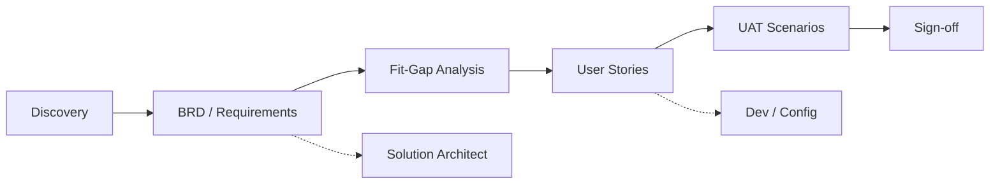

# Architecture

Repository architecture for Salesforce Enterprise Skills.

## Conceptual Layers

```
┌─────────────────────────────────────────────────────────────┐
│                    Consumer Layer                            │
│   Human Practitioners  │  Cursor Agents  │  CI/Lint (future) │
└────────────────────────────┬────────────────────────────────┘
                             │
┌────────────────────────────▼────────────────────────────────┐
│                    Skill Layer                               │
│   salesforce-business-analyst/  (more skills in roadmap)     │
│   skill.md → playbooks → templates → knowledge → scenarios   │
└────────────────────────────┬────────────────────────────────┘
                             │
┌────────────────────────────▼────────────────────────────────┐
│                    Shared Layer                              │
│   glossary │ taxonomy │ standards │ capability map           │
└────────────────────────────┬────────────────────────────────┘
                             │
┌────────────────────────────▼────────────────────────────────┐
│                    Governance Layer                          │
│   docs/ │ .cursor/ │ quality-framework │ review-process    │
└─────────────────────────────────────────────────────────────┘
```

## Skill Internal Architecture

Each skill follows a consistent internal structure:

| Component | Role |
|-----------|------|
| `skill.md` | Entry point: triggers, workflow, brain orchestration |
| `brain/` | Reasoning, validation, decision, and output engines (Sprint 1) |
| `knowledge/` | Enterprise Knowledge Base (Sprint 2) — 27 articles |
| `playbooks/` | Sprint 4 consulting methodologies (15 playbooks) |
| `templates/` | Sprint 3 deliverable scaffolds (31 templates) |
| `scenarios/` | Sprint 5 industry domain scenarios (6 industries) |
| `interview-guide/` | Sprint 6 interview intelligence (670 items) |
| `validation/` | Sprint 8 enterprise validation, benchmarks, certification |
| `implementation/` | Sprint 9 extension governance, sprint index, build standards |
| `learning-paths/` | Sprint 9 L1–L5 career curricula |
| `skill-guide.md` | Sprint 9 full enterprise narrative |
| `ba-maturity-model.md` | Sprint 9 competency and maturity framework |
| `examples/` | Worked examples (anonymized) |
| `checklists.md` | Quality gates |
| `prompts.md` | Reusable agent/human prompts |

## Data Flow (Requirement Lifecycle)



## Agent Interaction Model

1. **Route** — `.cursor/routing.md` selects skill, brain module, and playbook
2. **Load** — `skill.md` + relevant brain modules + template
3. **Enrich** — `knowledge/` and `scenarios/` as needed
4. **Generate** — Apply `shared/output-standards.md`
5. **Validate** — `brain/validation-framework.md` + `checklists.md`

## Extension Points

New skills should:

- Live as sibling folders to `salesforce-business-analyst/`
- Reuse `shared/` assets (do not fork glossary)
- Register routes in `.cursor/routing.md`
- Document metadata schema compliance in `docs/metadata-schema.md`

## Versioning

Skills version independently. Repository version follows semver at root `CHANGELOG.md`. See [versioning.md](versioning.md).

## Related Brain Modules

N/A — no direct relationships for this document type.

## Related Knowledge

- [Readme](../salesforce-business-analyst/knowledge/README.md)

## Related Templates

- [Readme](../salesforce-business-analyst/templates/README.md)

## Related Playbooks

- [Readme](../salesforce-business-analyst/playbooks/README.md)

## Related Industry Scenarios

- [Readme](../salesforce-business-analyst/scenarios/README.md)

## Related Interview Topics

- [Interview Index](../salesforce-business-analyst/interview-guide/interview-index.md)

## Related Examples

- [Readme](../examples/sample-project/README.md)

## Related Documents

- [Metadata Schema](metadata-schema.md)
- [Cross Linking Framework](cross-linking-framework.md)

## Traceability

**Upstream:** — | **Downstream:** All repository documents | **Validation:** validate_metadata.py

## Navigation

- **Previous:** —
- **Next:** [Branching Strategy](branching-strategy.md)
- **See Also:** [cross-linking-framework](cross-linking-framework.md)

## Version History

| Version | Date | Author | Summary |
|---------|------|--------|---------|
| 1.1.0 | 2026-07-02 | BA Practice Lead | Sprint 7 cross-linking and metadata enrichment |
