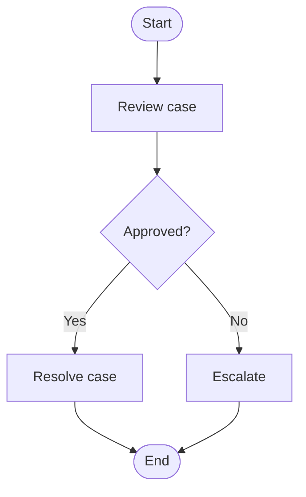

# BPMN for Business Analysts

## Overview

BPMN 2.0 symbols and practices for documenting complex enterprise processes on Salesforce programs.

## Purpose

Provide a standard notation when swimlanes are insufficient for gateways, events, and parallel flows.

## Why It Matters

Ambiguous branching logic causes wrong Flow design and missed exception handling.

## Business Context

BPMN is widely recognized by enterprise architecture and process improvement teams.

## Salesforce Context

BPMN diagrams inform Flow, approval processes, and OmniStudio procedures—BA documents behaviour; architect/dev implement.

## Core Concepts

| Symbol | Meaning |
|--------|---------|
| Pool | Organization or major system boundary |
| Lane | Role or department within pool |
| Task | Activity step |
| Gateway | Decision split (XOR, AND, OR) |
| Start/End event | Process trigger and completion |
| Intermediate event | Timer, message, error |

## Key Terminology

| Term | Definition |
|------|------------|
| XOR gateway | Exclusive choice—one path |
| AND gateway | Parallel paths |

## Frameworks and Models

BPMN 2.0 subset sufficient for most CRM processes. Full spec for enterprise BPM teams.

## Enterprise Best Practices

- Include legend on every diagram
- Version diagrams with BRD
- Model exception paths, not only happy path

## Common Mistakes

- BPMN as shelf-ware unused in delivery
- Diagrams too large to maintain

## Anti-Patterns

- Every process in BPMN when swimlane suffices
- BPMN without business review

## Decision Guidelines

Use BPMN when: multiple gateways, timers, or cross-pool messages. Otherwise use [process-mapping.md](process-mapping.md) swimlanes.

## Real-World Examples

Case escalation: SLA timer event → notify manager → parallel approval gateway.

## Industry Considerations

Public sector: FOIA or grant approval chains benefit from explicit gateway documentation.

## AI Guidance

Export mermaid or describe BPMN elements when user needs formal process notation.

## Review Checklist

- [ ] Legend present
- [ ] Exception paths modeled
- [ ] Linked to FR or BR IDs

## Related Brain Modules

- [Reasoning Framework](../brain/reasoning-framework.md)
- [Output Framework](../brain/output-framework.md)

## Related Knowledge

- [Readme](README.md)

## Related Templates

- [Readme](../templates/README.md)

## Related Playbooks

- [Readme](../playbooks/README.md)

## Related Industry Scenarios

- [Readme](../scenarios/README.md)

## Related Interview Topics

- [Interview Index](../interview-guide/interview-index.md)

## Related Examples

- [Readme](../../examples/sample-project/README.md)

## Related Documents

- [Skill](../skill.md)
- [Readme](README.md)

## Traceability

**Upstream:** Brain modules | **Downstream:** Templates, playbooks, deliverables | **Validation:** checklists.md

## Navigation

- **Previous:** [Babok Guide](babok-guide.md)
- **Next:** [Business Analysis Fundamentals](business-analysis-fundamentals.md)
- **See Also:** [skill.md](../skill.md)

## Version History

| Version | Date | Author | Summary |
|---------|------|--------|---------|
| 1.1.0 | 2026-07-02 | BA Practice Lead | Sprint 7 cross-linking and metadata enrichment |
