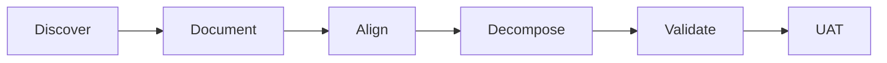

# Business Analysis Fundamentals

## Overview

Foundational concepts of enterprise business analysis on Salesforce programs—lifecycle, deliverables, competencies, and consulting mindset.

## Purpose

Establish what BA work is, where it sits in the implementation lifecycle, and how it connects business outcomes to Salesforce delivery.

## Why It Matters

Without shared BA fundamentals, teams conflate documentation with analysis, produce untestable scope, and rework requirements late in UAT.

## Business Context

Enterprise transformation requires a disciplined bridge between strategy, process design, and system implementation. The BA owns that bridge—not the technical build.

## Salesforce Context

Salesforce BAs operate across discovery, fit-gap, agile backlog, integration requirements, and UAT within multi-cloud, multi-release programs.

## Core Concepts

- **BA lifecycle:** Initiate → Plan → Elicit → Analyze → Specify → Validate → Manage
- **Key deliverables:** BRD, FRD, user stories, fit-gap, process maps, RAID, RTM, UAT scenarios
- **Competencies:** Facilitation, platform literacy, traceability, stakeholder management, options analysis
- **Methodologies:** Agile with BRD anchor for enterprise; thin-slice releases

## Key Terminology

| Term | Definition |
|------|------------|
| AS-IS | Current state process and systems |
| TO-BE | Target future state capabilities |
| Fit-gap | Standard vs config vs custom decision |
| Traceability | BR → FR → US → TS linkage |

## Frameworks and Models

- Salesforce implementation: discover, design, build, test, deploy, adopt
- Repository workflow: [../skill.md](../skill.md) seven-step core workflow
- BABOK knowledge areas: see [babok-guide.md](babok-guide.md)

## Enterprise Best Practices

- Start with measurable outcomes, not screens
- Maintain RAID from first workshop
- Validate early with demos and scenario walkthroughs
- Document out-of-scope explicitly

## Common Mistakes

- Jumping to fields/objects before understanding process
- BA as passive meeting scribe
- Skipping stakeholder dissent capture

## Anti-Patterns

- Template filling without elicitation
- Screen specifications masquerading as requirements

## Decision Guidelines

| Situation | Guidance |
|-----------|----------|
| Enterprise transformation | Full lifecycle with BRD anchor |
| Small enhancement | Lightweight BRD + stories with explicit risk acceptance |
| Regulated industry | Compliance items as TBC with Legal |

## Real-World Examples

Fictional Apex Manufacturing: discovery workshops → BRD → fit-gap → dealer portal stories across three releases. See [../../examples/sample-project/README.md](../../examples/sample-project/README.md).

## Industry Considerations

Regulated industries require compliance controls documented with owners—not BA certification of compliance.

## AI Guidance

Load when user asks what a Salesforce BA does or how BA fits delivery. Pair with [../brain/identity.md](../brain/identity.md).

## Review Checklist

- [ ] Enterprise-ready and Salesforce-aligned
- [ ] Cross-links verified
- [ ] No duplication of brain identity content

## Related Brain Modules

- [Reasoning Framework](../brain/reasoning-framework.md)
- [Output Framework](../brain/output-framework.md)

## Related Knowledge

- [Readme](README.md)

## Related Templates

- [Readme](../templates/README.md)

## Related Playbooks

- [Readme](../playbooks/README.md)

## Related Industry Scenarios

- [Readme](../scenarios/README.md)

## Related Interview Topics

- [Business Analysis](../interview-guide/business-analysis.md)

## Related Examples

- [Readme](../../examples/sample-project/README.md)

## Related Documents

- [Skill](../skill.md)
- [Readme](README.md)

## Traceability

**Upstream:** Brain modules | **Downstream:** Templates, playbooks, deliverables | **Validation:** checklists.md

## Navigation

- **Previous:** [Bpmn](bpmn.md)
- **Next:** [Business Rules](business-rules.md)
- **See Also:** [skill.md](../skill.md)

## Version History

| Version | Date | Author | Summary |
|---------|------|--------|---------|
| 1.1.0 | 2026-07-02 | BA Practice Lead | Sprint 7 cross-linking and metadata enrichment |
