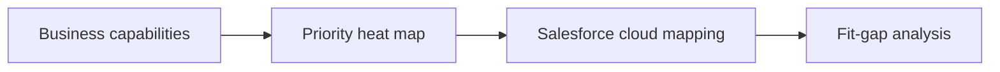

# Capability Models

## Overview

Business capability mapping, maturity assessment, and Salesforce alignment for transformation programs.

## Purpose

Express what the organization does independent of systems—then map to Salesforce clouds and fit-gap decisions.

## Why It Matters

Capability thinking prevents org-chart-driven design and surfaces gaps before object modeling.

## Business Context

Capabilities are stable; systems and processes change. Heat maps guide investment.

## Salesforce Context

Map capabilities to [../../shared/salesforce-capability-map.md](../../shared/salesforce-capability-map.md)—flag licensing (CPQ, FSL, Data Cloud).

## Core Concepts

- **Business capability:** What the org does (e.g., "Manage dealer relationships")
- **Maturity:** Ad hoc → defined → managed → optimized
- **Value realization:** KPI movement tied to capability investment

## Key Terminology

| Term | Definition |
|------|------------|
| Capability map | Structured view of business capabilities |
| TOM | Target operating model |

## Frameworks and Models

- Capability-based planning
- Link to [future-state-design.md](future-state-design.md) and [current-state-analysis.md](current-state-analysis.md)

## Enterprise Best Practices

- Workshop capability map with business, not IT-only
- Refresh at phase gates, not one-time
- Tie Must capabilities to release plan

## Common Mistakes

- Confusing departments with capabilities
- Capability map disconnected from backlog

## Anti-Patterns

- "Salesforce will fix our process" without capability gap analysis

## Decision Guidelines

High maturity gap + high value = prioritize in early release.

## Real-World Examples

"Unified customer view" capability → Account 360 on Sales + Service + ERP sync.

## Industry Considerations

Manufacturing: aftermarket service capabilities often undervalued in initial CRM scope.

## AI Guidance

Use capability language in discovery readouts before object names.

## Review Checklist

- [ ] Capabilities are verb-noun business language
- [ ] Salesforce mapping references capability map
- [ ] Maturity or priority indicated

## Related Brain Modules

- [Reasoning Framework](../brain/reasoning-framework.md)
- [Output Framework](../brain/output-framework.md)

## Related Knowledge

- [Readme](README.md)

## Related Templates

- [Readme](../templates/README.md)

## Related Playbooks

- [Readme](../playbooks/README.md)

## Related Industry Scenarios

- [Readme](../scenarios/README.md)

## Related Interview Topics

- [Interview Index](../interview-guide/interview-index.md)

## Related Examples

- [Readme](../../examples/sample-project/README.md)

## Related Documents

- [Skill](../skill.md)
- [Readme](README.md)

## Traceability

**Upstream:** Brain modules | **Downstream:** Templates, playbooks, deliverables | **Validation:** checklists.md

## Navigation

- **Previous:** [Business Rules](business-rules.md)
- **Next:** [Constraints Management](constraints-management.md)
- **See Also:** [skill.md](../skill.md)

## Version History

| Version | Date | Author | Summary |
|---------|------|--------|---------|
| 1.1.0 | 2026-07-02 | BA Practice Lead | Sprint 7 cross-linking and metadata enrichment |
