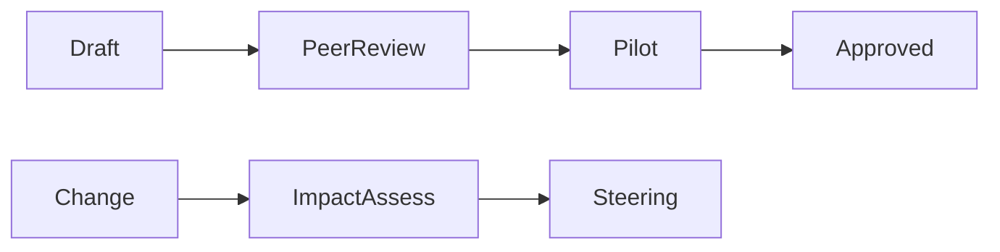

# Governance Framework

## Overview

Decision-making, standards, architecture governance, change control, and quality gates for Salesforce BA programs.

## Purpose

Lightweight governance that enables speed with accountability—not bureaucracy.

## Why It Matters

Without governance, fit-gap decisions regress and scope creep erodes outcomes.

## Business Context

Steering, architecture review, and change control protect investment and alignment.

## Salesforce Context

Architecture review for Extend/Gap; admin governance for org strategy; documentation standards from repository.

## Core Concepts

| Mechanism | Purpose |
|-----------|---------|
| Steering | Priority, scope, risk decisions |
| Architecture review | Extend, integration, security |
| Change control | Material scope change impact |
| Documentation standards | Metadata, IDs, traceability |
| Quality gates | checklists, brain validation, peer review |

## Key Terminology

See [../../docs/quality-framework.md](../../docs/quality-framework.md), [../../docs/review-process.md](../../docs/review-process.md).

## Frameworks and Models

Repository governance in `docs/`; program RAID and decision log.

## Enterprise Best Practices

- Decision log with ID, owner, date
- Traceability maintained continuously
- Change requests for material BR changes post-sign-off

## Common Mistakes

- Governance documents unused
- Skipping architect review on integration Must-haves

## Anti-Patterns

- Heavy templates nobody reads
- Bypassing change control for "small" Must changes

## Decision Guidelines

Material = affects Must scope, timeline, cost, or risk → formal change request.

## Real-World Examples

D-02: CPQ deferred to R2—steering approved with ERP quoting workaround.

## Industry Considerations

Regulated: stronger documentation and approval evidence requirements.

## AI Guidance

Follow [../brain/validation-framework.md](../brain/validation-framework.md) and repository review process for skill changes.

## Review Checklist

- [ ] Decisions logged
- [ ] Quality gate applied before client delivery
- [ ] Change impact assessed when scope shifts

## Related Brain Modules

- [Reasoning Framework](../brain/reasoning-framework.md)
- [Output Framework](../brain/output-framework.md)

## Related Knowledge

- [Readme](README.md)

## Related Templates

- [Readme](../templates/README.md)

## Related Playbooks

- [Readme](../playbooks/README.md)

## Related Industry Scenarios

- [Readme](../scenarios/README.md)

## Related Interview Topics

- [Leadership](../interview-guide/delivery/leadership.md)
- [Risk Management](../interview-guide/delivery/risk-management.md)

## Related Examples

- [Readme](../../examples/sample-project/README.md)

## Related Documents

- [Skill](../skill.md)
- [Readme](README.md)

## Traceability

**Upstream:** Brain modules | **Downstream:** Templates, playbooks, deliverables | **Validation:** checklists.md

## Navigation

- **Previous:** [Future State Design](future-state-design.md)
- **Next:** [Industry Patterns](industry-patterns.md)
- **See Also:** [skill.md](../skill.md)

## Version History

| Version | Date | Author | Summary |
|---------|------|--------|---------|
| 1.1.0 | 2026-07-02 | BA Practice Lead | Sprint 7 cross-linking and metadata enrichment |
