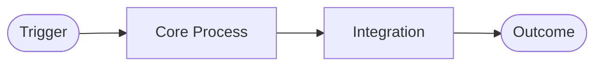

# Healthcare Patient Onboarding

## Executive Summary

Synthetic healthcare scenario: Healthcare Patient Onboarding.

## Industry Context

Fictional enterprise scenario for BA training and AI-assisted delivery. Company names and data are synthetic.

## Business Problem

Registration, consent, insurance capture

## Business Objectives

Reduce intake time

## Scope

**In scope:** Core process on Salesforce clouds listed in metadata.

**Out of scope:** Adjacent systems replacement unless noted in integration landscape.

## Business Capabilities

See capability mapping in Salesforce Capability Mapping section.

## Stakeholders

| Role | Interest |
|------|----------|
| Executive Sponsor | Outcomes, ROI |
| Operations | Workflow fit |
| IT / Integration | APIs, data |
| Compliance | Controls (TBC Legal) |

## Current State

Legacy processes, manual handoffs, fragmented customer data, limited self-service.

## Pain Points

- High manual effort and error rates
- Poor visibility across channels
- SLA breaches and customer dissatisfaction

## Future State

Digitized workflow on Salesforce with integration to systems of record, self-service where appropriate, and measurable KPIs.

## Business Process Flow

## Salesforce Capability Mapping

| Capability | Salesforce |
|------------|------------|
| Core process | Health Cloud |
| Portal/self-service | Experience Cloud |
| Integration | Platform APIs |

## Integration Landscape

| System | Role | Pattern |
|--------|------|---------|
| ERP / BSS | System of record | Batch / API TBC |
| IAM | Authentication | SSO SAML/OIDC |
| Data warehouse | Analytics | Batch export |

## Data Considerations

Master data ownership, external IDs, duplicate rules, retention—document in data dictionary.

## Security Considerations

Role-based access, FLS, external user model for portals. See [../knowledge/security-model.md](../../knowledge/security-model.md).

## Regulatory & Compliance Considerations

Industry controls documented as TBC with Legal/Compliance—BA does not certify compliance.

## Risks

| ID | Risk | Mitigation |
|----|------|------------|
| R-001 | Integration delay | Mock services for SIT |

## Assumptions

| ID | Assumption | Validate by |
|----|------------|-------------|
| A-001 | API availability | Integration workshop |

## Constraints

Budget, timeline, license edition—confirm with sponsor.

## Dependencies

| ID | Dependency | Needed by |
|----|------------|-----------|
| DEP-001 | IAM SSO | UAT start |

## Functional Requirements

| ID | Requirement | Priority |
|----|-------------|----------|
| FR-001 | Core capability for this scenario | Must |

## Non-Functional Requirements

| ID | Category | Requirement |
|----|----------|-------------|
| NFR-001 | Performance | P95 response within agreed SLA |

## Example Epics

**EP-201 Onboarding** — measurable business outcome.

## Example Features

| Feature | Epic | Value |
|---------|------|-------|
| Core workflow | EP-001 | Primary outcome |

## Example User Stories

**US-201 As patient I want digital intake forms**

## Acceptance Criteria

**Given referral When complete intake Then chart created**

## Example Test Scenarios

| TS ID | US ID | Scenario |
|-------|-------|----------|
| TS-001 | US-001 | Happy path end-to-end |

## RTM Example

| BR | FR | US | TS | Status |
|----|----|----|-----|--------|
| BR-001 | FR-001 | US-001 | TS-001 | Proposed |

## Recommended Deliverables

BRD, FRD, process maps, RAID, RTM, UAT pack—see [../templates/README.md](../../templates/README.md).

## Solution Recommendation

Standard → Config → Flow before Extend; document in fit-gap. Use [../playbooks/solution-recommendation-playbook.md](../../playbooks/solution-recommendation-playbook.md).

## Success Metrics

| KPI | Baseline | Target |
|-----|----------|--------|
| Cycle time | TBC | -20% |
| Customer satisfaction | TBC | +10 pts |

## Lessons Learned

- Validate integration early
- Thin-slice releases
- Security workshops before portal stories

## Best Practices

Load industry scenario + [../brain/reasoning-framework.md](../../brain/reasoning-framework.md) before elicitation.

## Common Anti-Patterns

- Screen-first requirements
- Ignoring compliance TBC
- Big-bang go-live

## AI Guidance

**Ask:** volume, channels, systems of record, regulations, release timeline.

**Escalate:** compliance claims, high-volume integration, multi-cloud without priority.

**Outputs:** BRD sections, stories with AC, fit-gap rows, RAID entries.

## Related Brain Modules

- [Reasoning Framework](../../brain/reasoning-framework.md)
- [Decision Framework](../../brain/decision-framework.md)

## Related Knowledge

- [Industry Patterns](../../knowledge/industry-patterns.md)

## Related Templates

- [Brd Template](../../templates/brd-template.md)

## Related Playbooks

- [Discovery Workshop Playbook](../../playbooks/discovery-workshop-playbook.md)

## Related Industry Scenarios

- [Readme](../README.md)

## Related Interview Topics

- [Scenario Questions](../../interview-guide/advanced/scenario-questions.md)

## Related Examples

- [Readme](../../../examples/sample-project/README.md)

## Related Documents

- [Skill](../../skill.md)
- [Readme](../README.md)

## Traceability

**Upstream:** Knowledge, playbooks | **Downstream:** BRD examples, interview scenarios | **Validation:** fit-gap analysis

## Navigation

- **Previous:** [Claims](claims.md)
- **Next:** —
- **See Also:** [skill.md](../../skill.md)

## Version History

| Version | Date | Author | Summary |
|---------|------|--------|---------|
| 1.1.0 | 2026-07-02 | BA Practice Lead | Sprint 7 cross-linking and metadata enrichment |
