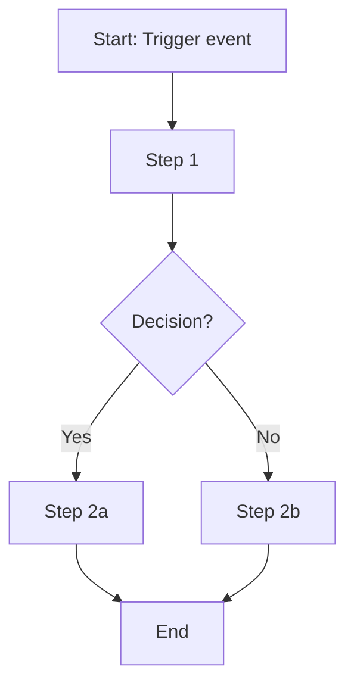
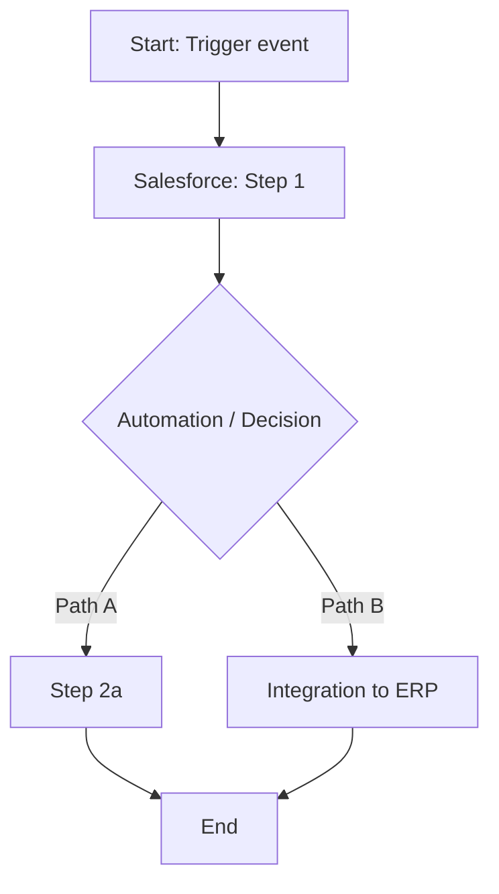

# Process Map Template

---
title: Process Map
type: process-map
version: 0.1.0
status: draft
last_updated: YYYY-MM-DD
project: PRJ-XXX-001
---

# Process: [Process Name]

## Overview

| Field | Value |
|-------|-------|
| Process owner | |
| Trigger | |
| Outcome | |
| Systems involved | Salesforce, [others] |

## AS-IS Process

### AS-IS Pain Points

| Step | Pain Point | Impact |
|------|------------|--------|
| | | |

## TO-BE Process

### TO-BE Changes

| Step | Change | Requirement Ref |
|------|--------|-----------------|
| | | BR-xxx |

## Swimlane (Optional)

| Step | Sales Rep | System | Manager | Integration |
|------|-----------|--------|---------|-------------|
| 1 | | | | |
| 2 | | | | |

## Metrics

| Metric | AS-IS | TO-BE Target |
|--------|-------|--------------|
| Cycle time | | |
| Error rate | | |
| Manual touchpoints | | |

## Related Brain Modules

- [Output Framework](../brain/output-framework.md)
- [Validation Framework](../brain/validation-framework.md)

## Related Knowledge

- [Readme](../knowledge/README.md)

## Related Templates

- [Readme](README.md)

## Related Playbooks

- [Readme](../playbooks/README.md)

## Related Industry Scenarios

- [Readme](../scenarios/README.md)

## Related Interview Topics

- [User Stories](../interview-guide/user-stories.md)

## Related Examples

- [Brd Excerpt](../../examples/sample-brd/brd-excerpt.md)

## Related Documents

- [Skill](../skill.md)
- [Readme](README.md)

## Traceability

**Upstream:** Knowledge, BRD/FRD | **Downstream:** Playbooks, user stories, RTM | **Validation:** validation-framework.md

## Navigation

- **Previous:** [Process Flow Template](process-flow-template.md)
- **Next:** [Raci Template](raci-template.md)
- **See Also:** [skill.md](../skill.md)

## Version History

| Version | Date | Author | Summary |
|---------|------|--------|---------|
| 1.1.0 | 2026-07-02 | BA Practice Lead | Sprint 7 cross-linking and metadata enrichment |
