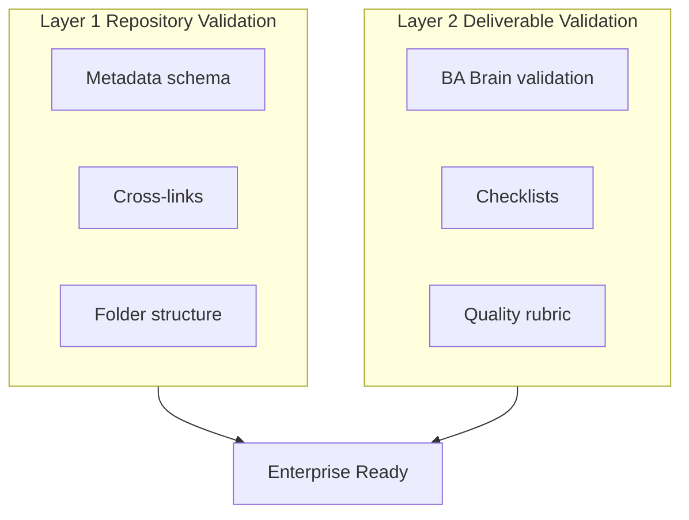

# Enterprise Validation Framework

Sprint 8 two-layer validation model for the Salesforce Business Analyst skill.

## Overview



## Layer 1 — Repository Validation

Ensures the knowledge system is structurally sound and AI-retrieval ready.

| Check | Tool / Document | Pass criteria |
|-------|-----------------|---------------|
| YAML metadata | `scripts/validate_metadata.py` | Required fields, Related sections |
| Relative links | `scripts/validate_metadata.py` | All links resolve |
| Folder structure | `scripts/validate_repository.py` | Required BA folders exist |
| Cross-linking | [docs/cross-linking-framework.md](../../docs/cross-linking-framework.md) | Mandatory sections present |

**When to run:** Before merge, after bulk enrichment, on CI (recommended).

## Layer 2 — Deliverable Validation

Ensures generated or authored BA artifacts meet enterprise quality bars.

| Stage | Load | Validate |
|-------|------|----------|
| Before any response | [brain/validation-framework.md](../brain/validation-framework.md) | Completeness, traceability |
| Claim accuracy | [brain/anti-hallucination.md](../brain/anti-hallucination.md) | No unsupported Salesforce claims |
| Artifact-specific | [checklists.md](../checklists.md) | BRD, story, RAID, UAT gates |
| Quality dimensions | [docs/quality-framework.md](../../docs/quality-framework.md) | Accuracy, clarity, consistency |

## Validation Workflow

```
1. Author / AI generates deliverable
2. Run brain validation-framework + anti-hallucination
3. Run artifact checklist (BRD, story, etc.)
4. Peer review for enterprise programs
5. Link to RTM / traceability matrix
6. Sign-off per governance playbook
```

## Integration with Maturity Model

| Maturity level | Validation focus |
|----------------|------------------|
| L1 Associate | Checklists for stories and AC |
| L2 Analyst | BRD/FRD + RTM validation |
| L3 Senior | Fit-gap + solution recommendation review |
| L4 Lead | Repository validation + team QA |
| L5 Principal | Certification reports + knowledge governance |

See [../ba-maturity-model.md](../ba-maturity-model.md) (Sprint 9).

## Certification

Use [certification-report-template.md](certification-report-template.md) with [benchmark-scenarios.md](benchmark-scenarios.md) and [interview-guide/interview-index.md](../interview-guide/interview-index.md).

## Related Brain Modules

- [Validation Framework](../brain/validation-framework.md)
- [Anti Hallucination](../brain/anti-hallucination.md)

## Related Knowledge

- [Governance Framework](../knowledge/governance-framework.md)

## Related Templates

- [Readme](../templates/README.md)

## Related Playbooks

- [Production Readiness Playbook](../playbooks/production-readiness-playbook.md)

## Related Industry Scenarios

- [Readme](../scenarios/README.md)

## Related Interview Topics

- [Interview Index](../interview-guide/interview-index.md)

## Related Examples

- [Readme](../../examples/sample-project/README.md)

## Related Documents

- [Readme](README.md)
- [Quality Framework](../../docs/quality-framework.md)
- [Validate_Repository](../../scripts/validate_repository.py)

## Traceability

**Upstream:** Brain validation, governance | **Downstream:** Certification, maturity assessments | **Validation:** validate_repository.py

## Navigation

- **Previous:** [Certification Report Template](certification-report-template.md)
- **Next:** [Readme](README.md)
- **See Also:** [skill.md](../skill.md)

## Version History

| Version | Date | Author | Summary |
|---------|------|--------|---------|
| 1.1.0 | 2026-07-02 | BA Practice Lead | Sprint 7 cross-linking and metadata enrichment |
